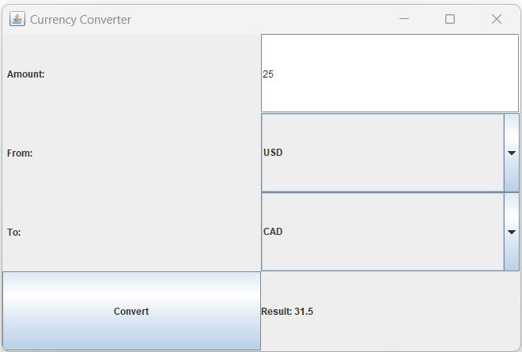

# CurrencyConverterApp
The Currency Converter project is a simple Java application that allows the user to convert an amount from one currency to another. The application has a graphical user interface (GUI) and it also uses a SQL Server database to store the conversion rates between the currencies.

# Usage
To use the currency converter, run the CurrencyConverter.java file. This will open a window with the application interface. Enter the amount to convert, select the currencies to convert from and to, and click the "Convert" button. The converted amount will be displayed below. 
The currencies that can be converted are limited

# Files
`CurrencyConverter.java` - the main Java file for the application

`CurrencySqlQuery.sql` - a SQL file that contains the create table statement and initial data insert statements

